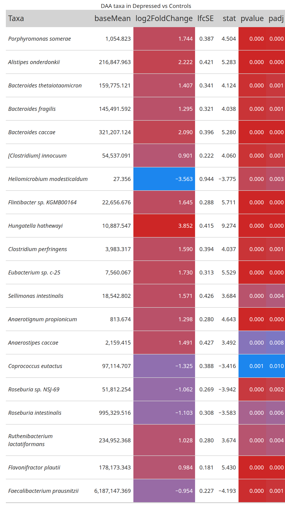
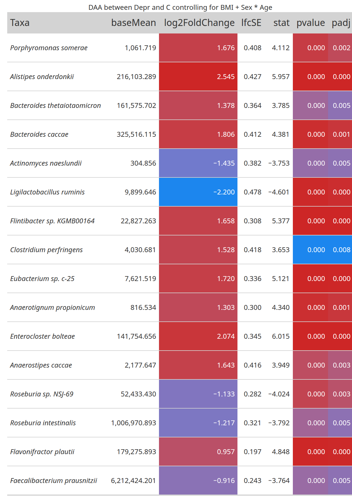

<!-- README.md is generated from README.Rmd. Please edit that file -->

```{r, include = FALSE}
knitr::opts_chunk$set(
  collapse = TRUE,
  comment = "#>",
  fig.path = "man/figures/README-",
  out.width = "100%"
)
```

# G4Micro

<!-- badges: start -->
[](https://github.com/CarlosMoraMartinez/G4Micro/actions/workflows/R-CMD-check.yaml)
<!-- badges: end -->

G4Micro contains helper functions used to analyze microbiome data in the Mora-Martinez, Molina-Mendoza et al. paper. 

## Installation

First, it is necessary to install the following packages and linux dependencies:

- sudo libgdal-dev libgeos-dev libproj-dev
- DMwR2
- UBL
- catboost

```bash
sudo apt-get update
sudo apt-get install -y libgdal-dev libgeos-dev libproj-dev
```

``` r
# install.packages("remotes")
# install.packages("devtools")

remotes::install_url("https://cran.r-project.org/src/contrib/Archive/DMwR2/DMwR2_0.0.2.tar.gz")
devtools::install_github("paobranco/UBL",ref="master")
remotes::install_github("catboost/catboost")

```

You can install the development version of G4Micro from [GitHub](https://github.com/) with:

``` r
# install.packages("pak")
pak::pak("CarlosMoraMartinez/G4Micro")

# Alternatively
devtools::install_github("Displayr/flipPlots")

```

## Alpha Diversity Analysis

Load a phyloseq object with filtered and rarefied counts:

```{r load, warning=FALSE, message=FALSE}
library(G4Micro)

data("phobj_raref")
phobj_raref
```

A list with default options is also loaded. Copy it and modify it to use a custom output directory. 

```{r load2}
opt <- opt_default
opt$out <- "~/test_g4micro/"
if(!dir.exists(opt$out)) dir.create(opt$out)

restoreopt <- restauraropt_mk(opt)
```

The `restoreopt` function will allow to reset the options to the state when `restauraropt_mk` was called. To do that, execute:

```{r load3}
opt <- restoreopt(opt)
```

Calculate alpha diversity indices:

```{r alpha1, warning=FALSE, message=FALSE}
outdir <- paste0(opt$out, "/AlphaDiversity/")
if(!dir.exists(outdir)) dir.create(outdir)

alpha_indices <-  c("Observed", "Chao1", "Shannon", "InvSimpson")

divtab <- calculateAlphaDiversityTable(phseq_obj = phobj_raref, outdir = outdir, 
                                       indices = alpha_indices, name = "AlphaDiv" )

divtab %>% select(sampleID, Condition, all_of(alpha_indices)) %>% 
  head %>% kableExtra::kable()
```

Test statistical differences between alpha diversity indices:

```{r alpha2, warning=FALSE, message=FALSE}

alphadif <- testDiversityDifferences(divtab, alpha_indices, 
                                     groupvars = c("Condition", "Sex"), 
                                     outdir = outdir, name = "AlphaDiv_test")

alphadif %>% kableExtra::kable()
```

Fit linear models using a main variable and several covariates:

```{r alpha3, warning=FALSE, warning=FALSE, message=FALSE}
interestvar <- "Condition"
extravars <- c("BMI", "Age", "Sex")

models <- makeLinearModelsSingleVariable(divtab, interestvar,
                                            extravars,
                                            alpha_indices,
                                            combos=1,
                                            outdir = outdir, 
                                            name = "linmodels1")
```

Now show tests for single variables:

```{r alpha4}
models$single_anovas %>% select(-mod1, -mod2, nvars, Index, 
                                model, reduced_model, Df, 
                                `Pr(>F)`, padj_all) %>% 
  kableExtra::kable()
```

Show tests using covariates:

```{r alpha5}
models$anovas %>% select(-mod1, -mod2, nvars, Index, 
                                model, reduced_model, Df, 
                                `Pr(>F)`, padj_all) %>% 
  kableExtra::kable()
```

Finally, plot differences (recalculating statistical tests):


```{r alpha6, fig.width=12, fig.height=14, warning=FALSE, message=FALSE}
library(cowplot)

cat_vars <- c("Condition", "Sex")
num_vars <- c("BMI", "bristol_scale")

divplots <- getAlphaDiversity(phobj_raref, 
                              vars = cat_vars, 
                              qvars = num_vars,
                              opt,
                              indices = alpha_indices,
                              correct_pvalues = T, correct_pvalues_indices = T,
                              name = "alphaplots1", w = 10, h = 4)

cowplot::plot_grid(plotlist = divplots, nrow = 4)
```

## Beta Diversity Analysis

PCoA on Bray-Curtis distances:

```{r beta1, fig.width=13, fig.height=14, warning=FALSE, message=FALSE}
library(cowplot)

vars <- c("Condition", "Sex", "BMI")
betaplots <- makeAllPCoAs(phobj_raref, outdir,
                          method = "PCoA",
                          name = "PCoA_Bray",
                          dist_type = "bray",
                          dist_name = "Bray-Curtis",
                          vars2plot = vars,
                          extradims = 2:3,
                          labelsamples = "sampleID",
                          create_pdfs = T)

cowplot::plot_grid(plotlist = betaplots, nrow = 3)
```

NMDS on Bray-Curtis distances:

```{r beta2, fig.width=12, fig.height=4, warning=FALSE, message=FALSE, error=FALSE}
library(cowplot)

vars <- c("Condition", "Sex")
betaplots <- makeAllPCoAs(phobj_raref, outdir,
                          method = "NMDS",
                          name = "NMDS_Bray",
                          dist_type = "bray",
                          dist_name = "Bray-Curtis",
                          vars2plot = vars,
                          extradims = 2,
                          labelsamples = "sampleID",
                          create_pdfs = T)

cowplot::plot_grid(plotlist = betaplots, nrow = 1)
```

Perform PERMANOVA with the `vegan::adonis2` function:

```{r beta3, fig.width=12, fig.height=4, warning=FALSE}
exclude_vars <- names(sample_data(phobj_raref))
exclude_vars <- exclude_vars[!exclude_vars %in% c("Condition", "Sex", "smoking_status")]
result <- makePermanova(phobj_raref,
              dist_method = "bray", 
              seed = 123, 
              exclude_vars = exclude_vars, 
              outname = "permatest") 

result %>% kableExtra::kable()
```

Perform PERMANOVA with the `vegan::adonis2` function, using covariates:

```{r beta4, fig.width=12, fig.height=4, warning=FALSE}
permaformulas <- c(
  "braydist ~ Condition + Sex",
  "braydist ~ Condition + BMI",
  "braydist ~ Condition + Age",
  "braydist ~ Condition + Sex + BMI",
  "braydist ~ Condition + BMI + Sex + Age"
)

result <- makePermanovaFormulas(phobj_raref,
                  permaformulas,
                  dist_method = "bray", 
                  seed = 123, 
                  outname = "adonis2formulas")

result$res %>% select(model, variable, DF_var, DF_Residual, DF_Total, R2_var, R2_Residual, R2_Total, F_statistic, P, padj) %>% kableExtra::kable()
```

Model objects can also be accessed:

```{r beta5, fig.width=12, fig.height=4, warning=FALSE}
result$modelos[[4]]

```

## Differential Abundance Analysis with DESeq2

First, use Sex and Age as covariates. We will use the `phyloseq` object with the raw counts, since `DESeq2` normalizes data internally.

Several tables and plots will be saved to the `opt$out` directory. 

```{r deseq1, fig.width=12, fig.height=4, warning=FALSE, error=FALSE, fig.show='hide', message=FALSE}
data("phobj_filtonly")
test_vars <- c("Condition", "Sex", "Age")

result <- deseq_full_pipeline(phobj_filtonly, name = "CondSexAge", vars2deseq = test_vars, opt = opt)

```

Several tables and plots will be saved automatically to the `opt$out` directory. 

See results table for the contrast of Condition:

```{r deseq2, fig.width=12, fig.height=4, warning=FALSE, error=FALSE}

taxa2plot <- result$all_contrasts$Condition_Depression_vs_Control$resdf %>% filter(!is.na(padj ) & padj < 0.01) %>% 
     arrange(padj) %>% pull(taxon) 
gtt <- result$all_contrasts$Condition_Depression_vs_Control$res %>% getGTTableFromRes(taxa2plot, "DAA taxa in Depressed vs Controls")
```
```{r deseq2b, fig.width=12, fig.height=4, warning=FALSE, error=FALSE, message=FALSE, echo=FALSE}
gt::gtsave(gtt, "man/figures/gt_table.png")

```

See results table for the contrast of Sex:

```{r deseq3, fig.width=12, fig.height=4, warning=FALSE, error=FALSE}

taxa2plot <- result$all_contrasts$Sex_Female_vs_Male$resdf %>% filter(!is.na(padj ) & padj < 0.01) %>% 
     arrange(padj) %>% pull(taxon) 
gtt <- result$all_contrasts$Sex_Female_vs_Male$res %>% getGTTableFromRes(taxa2plot, "DAA taxa in Women vs Men")
```
```{r deseq5b, fig.width=12, fig.height=4, warning=FALSE, error=FALSE, message=FALSE, echo=FALSE}
gt::gtsave(gtt, "man/figures/gt_table2.png")
knitr::include_graphics("man/figures/gt_table2.png")
```

See results table for the contrast of Age:

```{r deseq4, fig.width=12, fig.height=4, warning=FALSE, error=FALSE, message=FALSE}

taxa2plot <- result$all_contrasts$Age$resdf %>% filter(!is.na(padj ) & padj < 0.01) %>% 
     arrange(padj) %>% pull(taxon) 
gtt <- result$all_contrasts$Age$res %>% getGTTableFromRes(taxa2plot, "DAA taxa with Age")

```

```{r deseq6b, fig.width=12, fig.height=4, warning=FALSE, error=FALSE, message=FALSE, echo=FALSE}
gt::gtsave(gtt, "man/figures/gt_table3.png")
knitr::include_graphics("man/figures/gt_table3.png")
```


Make heatmap:

```{r deseq5, fig.width=12, fig.height=5, warning=FALSE, error=FALSE}

taxa2plot <- result$all_contrasts$Condition_Depression_vs_Control$resdf %>% filter(!is.na(padj ) & padj < 0.01) %>% 
     arrange(padj) %>% pull(taxon) 

makeHeatmap(result$all_contrasts$Condition_Depression_vs_Control$resdf, 
            result$dds, 
            result$vst_counts_df, 
            c("Condition", "Sex", "Age"),
            opt, 
            name ="test_heatmap",
            logscale = F, 
            ptype="padj", 
            trim_values = TRUE, 
            taxalist=taxa2plot, 
            max_hm_h=10, max_hm_w=12)

```

Also, different contrasts can be compared:

```{r deseq6, fig.width=12, fig.height=4, warning=FALSE, error=FALSE}

mainContrast <- result$all_contrasts$Condition_Depression_vs_Control
contrastlist2 <- list(
  result$all_contrasts$Sex_Female_vs_Male$resdf,
  result$all_contrasts$Age$resdf
) %>% lapply(\(x)return(list(resdf=x)))

names(contrastlist2) <- c( "Sex", "Age")

contrast_names_pretty <- c("Depression vs Control",  "Female vs Male", "Age")

compareLFCContrats2(contrastlist2, mainContrast, 
                   contrast_names_pretty, "Depression_vs_Control", 
                   plim_select= 0.001, plim_plot=0.05,
                   name2remove = "xxx",
                   resdfname="resdf", 
                   outdir = opt$out, 
                   name="LFC_Comparison_AgeAndBMI_allCombos_p05", 
                   w=12, h=12, scale_mode = "free")

restoreopt <- restauraropt_mk(opt)
```

## DESeq2 analysis with interaction

Instead of using several covariates in an additive way, one may specify more complex formulas with interactions:

```{r deseq7, fig.width=12, fig.height=4, warning=FALSE, error=FALSE, fig.show='hide', message=FALSE}

phobj_filtered <- subset_samples(
  phobj_filtonly,
  !is.na(Condition) &
  !is.na(Sex) &
  !is.na(BMI) &
  !is.na(Age)
)
result_int <- getDeseqResults(phobj_filtered, opt = opt, name = "CBSA_interaction", 
                          variables=NULL, formula="~ Condition + BMI + Sex * Age")


taxa2plot <- result_int$all_contrasts$Condition_Depression_vs_Control$resdf %>% 
  filter(!is.na(padj ) & padj < 0.01) %>% 
  arrange(padj) %>% pull(taxon) 

gtt <- result_int$all_contrasts$Condition_Depression_vs_Control$res %>% 
  getGTTableFromRes(taxa2plot, "DAA between Depr and C controlling for  BMI + Sex * Age")
```

```{r deseq7b, fig.width=12, fig.height=4, warning=FALSE, error=FALSE, message=FALSE, echo=FALSE}
gt::gtsave(gtt, "man/figures/gt_table4.png")


restoreopt <- restauraropt_mk(opt)
```


