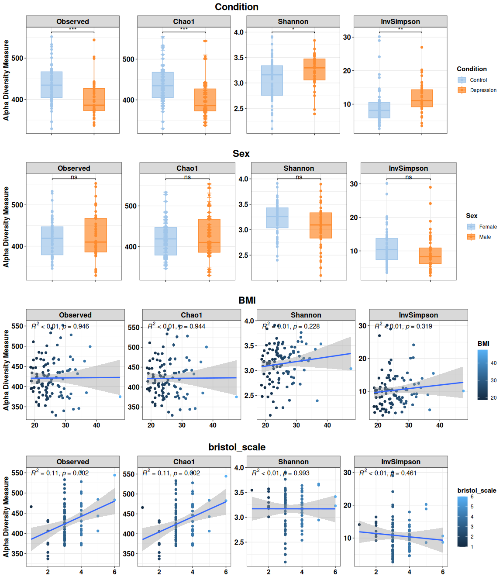

<!-- README.md is generated from README.Rmd. Please edit that file -->

# G4Micro

<!-- badges: start -->

[](https://github.com/CarlosMoraMartinez/G4Micro/actions/workflows/R-CMD-check.yaml)
<!-- badges: end -->

G4Micro contains helper functions used to analyze microbiome data in the
Mora-Martinez, Molina-Mendoza et al. paper.

## Installation

You can install the development version of G4Micro from
[GitHub](https://github.com/) with:

``` r
# install.packages("pak")
pak::pak("CarlosMoraMartinez/G4Micro")
```

## Example

Load a list of phyloseq objects and select one of them.

``` r
library(G4Micro)
#> Loading required package: dplyr
#> 
#> Attaching package: 'dplyr'
#> The following objects are masked from 'package:stats':
#> 
#>     filter, lag
#> The following objects are masked from 'package:base':
#> 
#>     intersect, setdiff, setequal, union
#> Loading required package: forcats
#> Loading required package: ggplot2
#> Loading required package: phyloseq
#> Loading required package: purrr
#> Loading required package: readr
#> Loading required package: stringr
#> Loading required package: tibble
#> Loading required package: tidyr
#> Warning: replacing previous import 'DESeq2::plotMA' by 'limma::plotMA' when
#> loading 'G4Micro'
#> Warning: replacing previous import 'magrittr::set_names' by 'purrr::set_names'
#> when loading 'G4Micro'
#> Warning: replacing previous import 'dplyr::lag' by 'stats::lag' when loading
#> 'G4Micro'
#> Warning: replacing previous import 'dplyr::filter' by 'stats::filter' when
#> loading 'G4Micro'
#> Warning: replacing previous import 'magrittr::extract' by 'tidyr::extract' when
#> loading 'G4Micro'
#> Warning: replacing previous import 'limma::plotMA' by 'DESeq2::plotMA' when
#> loading 'G4Micro'
#> Registered S3 methods overwritten by 'bmemLavaan':
#>   method        from
#>   summary.bmem  bmem
#>   summary.power bmem
#>   plot.bmem     bmem
#> Registered S3 method overwritten by 'dendextend':
#>   method     from 
#>   rev.hclust vegan
#> Warning: replacing previous import 'stats::filter' by 'dplyr::filter' when
#> loading 'G4Micro'
#> Registered S3 methods overwritten by 'ggpp':
#>   method                  from   
#>   heightDetails.titleGrob ggplot2
#>   widthDetails.titleGrob  ggplot2
#> Warning: replacing previous import 'limma::topTable' by
#> 'variancePartition::topTable' when loading 'G4Micro'

data("all_phyloseq")
phobj <- all_phyloseq$remove_tanda2_rarefied_min
phobj
#> phyloseq-class experiment-level object
#> otu_table()   OTU Table:         [ 820 taxa and 105 samples ]
#> sample_data() Sample Data:       [ 105 samples by 121 sample variables ]
#> tax_table()   Taxonomy Table:    [ 820 taxa by 8 taxonomic ranks ]
```

A list with default options is also loaded:

``` r
opt <- opt_default
print(opt)
#> $out
#> [1] "./"
#> 
#> $minfreq
#> [1] 0.05
#> 
#> $mincountspersample
#> [1] 0
#> 
#> $mincount
#> [1] 1
#> 
#> $minsampleswithcount
#> [1] 0
#> 
#> $raref_quant
#> [1] 0.15
#> 
#> $fc
#> [1] 1
#> 
#> $pval
#> [1] 0.05
#> 
#> $ptype
#> [1] "adjusted"
#> 
#> $fctype
#> [1] "shrunk"
#> 
#> $num_genes_default
#> [1] 5
```

Calculate alpha diversity indices

``` r
opt$out <- "~/"
outdir <- paste0(opt$out, "/AlphaDiversity/")
if(!dir.exists(outdir)) dir.create(outdir)

alpha_indices <-  c("Observed", "Chao1", "Shannon", "InvSimpson")

divtab <- calculateAlphaDiversityTable(phseq_obj = phobj, outdir = outdir, 
                                       indices = alpha_indices, name = "AlphaDiv" )

divtab %>% select(sampleID, Condition, all_of(alpha_indices)) %>% 
  head %>% kableExtra::kable()
#> Warning: 'xfun::attr()' is deprecated.
#> Use 'xfun::attr2()' instead.
#> See help("Deprecated")
#> Warning: 'xfun::attr()' is deprecated.
#> Use 'xfun::attr2()' instead.
#> See help("Deprecated")
```

| sampleID | Condition | Observed |  Chao1 |  Shannon | InvSimpson |
|:---------|:----------|---------:|-------:|---------:|-----------:|
| 1        | Control   |      398 | 398.50 | 2.657452 |   4.633405 |
| 10       | Control   |      385 | 385.00 | 2.648691 |   6.380959 |
| 100      | Control   |      329 | 329.00 | 2.982834 |   8.265564 |
| 102      | Control   |      467 | 470.75 | 2.400962 |   3.655553 |
| 103      | Control   |      447 | 447.00 | 3.509609 |  14.020145 |
| 104      | Control   |      425 | 426.00 | 3.350646 |  11.243856 |

Test statistical differences between alpha diversity indices:

``` r

alphadif <- testDiversityDifferences(divtab, alpha_indices, 
                                     groupvars = c("Condition", "Sexo"), 
                                     outdir = outdir, name = "AlphaDiv_test")

alphadif %>% kableExtra::kable()
#> Warning: 'xfun::attr()' is deprecated.
#> Use 'xfun::attr2()' instead.
#> See help("Deprecated")
#> Warning: 'xfun::attr()' is deprecated.
#> Use 'xfun::attr2()' instead.
#> See help("Deprecated")
```

| variable | groups | comparison | anova_F | anova_p | t_test | wilcox_test | shapiro_normality_test | bartlett_test | levene_test | t_corrected | wilcox_corrected |
|:---|:---|:---|---:|---:|---:|---:|---:|---:|---:|---:|---:|
| Observed | Condition | all | 17.7978164 | 0.0000530 | 0.0000534 | 0.0000116 | 0.0619656 | 0.8568824 | 0.5272713 | 0.0002357 | 0.0000521 |
| Observed | Sexo | all | 0.2479607 | 0.6195762 | 0.6314333 | 0.6967562 | 0.0619656 | 0.1402254 | 0.2483335 | 0.6314333 | 0.7039865 |
| Chao1 | Condition | all | 17.5858912 | 0.0000583 | 0.0000589 | 0.0000130 | 0.0555764 | 0.8639881 | 0.5548703 | 0.0002357 | 0.0000521 |
| Chao1 | Sexo | all | 0.2715406 | 0.6034188 | 0.6160029 | 0.7039865 | 0.0555764 | 0.1298843 | 0.2503562 | 0.6314333 | 0.7039865 |
| Shannon | Condition | all | 6.5589718 | 0.0118849 | 0.0081650 | 0.0094101 | 0.0316829 | 0.0450513 | 0.0448880 | 0.0163301 | 0.0188202 |
| Shannon | Sexo | all | 4.6825487 | 0.0327818 | 0.0413045 | 0.0479763 | 0.0316829 | 0.0625120 | 0.0753922 | 0.0660873 | 0.0639684 |
| InvSimpson | Condition | all | 7.3268397 | 0.0079536 | 0.0063039 | 0.0002664 | 0.0000007 | 0.2403767 | 0.8755440 | 0.0163301 | 0.0007105 |
| InvSimpson | Sexo | all | 2.6117387 | 0.1091344 | 0.1110623 | 0.0334241 | 0.0000007 | 0.8501868 | 0.9598410 | 0.1480830 | 0.0534785 |

Fit linear models using a main variable and several covariates:

``` r
interestvar <- "Condition"
extravars <- c("BMI", "bristol_scale", "Sexo")

models <- makeLinearModelsSingleVariable(divtab, interestvar,
                                            extravars,
                                            alpha_indices,
                                            combos=1,
                                            outdir = outdir, 
                                            name = "linmodels1")
```

Now show tests for single variables:

``` r
models$single_anovas %>% select(-mod1, -mod2, nvars, Index, 
                                model, reduced_model, Df, 
                                `Pr(>F)`, padj_all) %>% 
  kableExtra::kable()
#> Warning: 'xfun::attr()' is deprecated.
#> Use 'xfun::attr2()' instead.
#> See help("Deprecated")
#> Warning: 'xfun::attr()' is deprecated.
#> Use 'xfun::attr2()' instead.
#> See help("Deprecated")
```

| nvars | Index | model | reduced_model | Df | Sum Sq | Mean Sq | F value | Pr(\>F) | padj_all | padj_bymodel |
|---:|:---|:---|:---|---:|---:|---:|---:|---:|---:|---:|
| 0 | Observed | Observed ~ Condition | Observed ~ 1 | 1 | 3.523265e+04 | 3.523265e+04 | 17.7978164 | 0.0000530 | 0.0004660 | 0.0001165 |
| 0 | Observed | Observed ~ BMI | Observed ~ 1 | 1 | 1.093986e+01 | 1.093986e+01 | 0.0046904 | 0.9455340 | 0.9932575 | 0.9455340 |
| 0 | Observed | Observed ~ bristol_scale | Observed ~ 1 | 1 | 2.093868e+04 | 2.093868e+04 | 10.4855737 | 0.0017376 | 0.0070196 | 0.0035098 |
| 0 | Observed | Observed ~ Sexo | Observed ~ 1 | 1 | 5.743002e+02 | 5.743002e+02 | 0.2479607 | 0.6195762 | 0.7625554 | 0.6195762 |
| 0 | Chao1 | Chao1 ~ Condition | Chao1 ~ 1 | 1 | 3.511109e+04 | 3.511109e+04 | 17.5858912 | 0.0000583 | 0.0004660 | 0.0001165 |
| 0 | Chao1 | Chao1 ~ BMI | Chao1 ~ 1 | 1 | 1.156455e+01 | 1.156455e+01 | 0.0049232 | 0.9442004 | 0.9932575 | 0.9455340 |
| 0 | Chao1 | Chao1 ~ bristol_scale | Chao1 ~ 1 | 1 | 2.110632e+04 | 2.110632e+04 | 10.4648855 | 0.0017549 | 0.0070196 | 0.0035098 |
| 0 | Chao1 | Chao1 ~ Sexo | Chao1 ~ 1 | 1 | 6.330390e+02 | 6.330390e+02 | 0.2715406 | 0.6034188 | 0.7625554 | 0.6195762 |
| 0 | Shannon | Shannon ~ Condition | Shannon ~ 1 | 1 | 8.804086e-01 | 8.804086e-01 | 6.5589718 | 0.0118849 | 0.0316929 | 0.0118849 |
| 0 | Shannon | Shannon ~ BMI | Shannon ~ 1 | 1 | 2.073893e-01 | 2.073893e-01 | 1.4736690 | 0.2275987 | 0.4046199 | 0.6375174 |
| 0 | Shannon | Shannon ~ bristol_scale | Shannon ~ 1 | 1 | 1.020000e-05 | 1.020000e-05 | 0.0000718 | 0.9932575 | 0.9932575 | 0.9932575 |
| 0 | Shannon | Shannon ~ Sexo | Shannon ~ 1 | 1 | 6.394895e-01 | 6.394895e-01 | 4.6825487 | 0.0327818 | 0.0749299 | 0.1311273 |
| 0 | InvSimpson | InvSimpson ~ Condition | InvSimpson ~ 1 | 1 | 1.951732e+02 | 1.951732e+02 | 7.3268397 | 0.0079536 | 0.0254514 | 0.0106048 |
| 0 | InvSimpson | InvSimpson ~ BMI | InvSimpson ~ 1 | 1 | 2.833181e+01 | 2.833181e+01 | 1.0039184 | 0.3187587 | 0.5100139 | 0.6375174 |
| 0 | InvSimpson | InvSimpson ~ bristol_scale | InvSimpson ~ 1 | 1 | 1.533401e+01 | 1.533401e+01 | 0.5475927 | 0.4614164 | 0.6711512 | 0.6152219 |
| 0 | InvSimpson | InvSimpson ~ Sexo | InvSimpson ~ 1 | 1 | 7.267788e+01 | 7.267788e+01 | 2.6117387 | 0.1091344 | 0.2182687 | 0.2182687 |

Finally, plot differences (recalculating statistical tests):

``` r
library(cowplot)

cat_vars <- c("Condition", "Sexo")
num_vars <- c("BMI", "bristol_scale")

divplots <- getAlphaDiversity(phobj, 
                              vars = cat_vars, 
                              qvars = num_vars,
                              opt,
                              indices = alpha_indices,
                              correct_pvalues = T, correct_pvalues_indices = T,
                              name = "alphaplots1", w = 10, h = 4)

cowplot::plot_grid(plotlist = divplots, ncol = 4)
```


