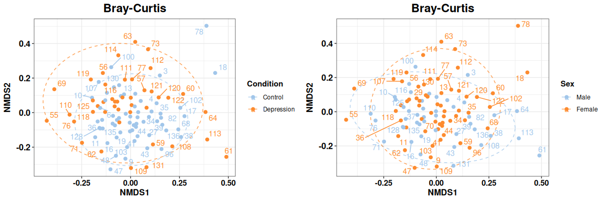
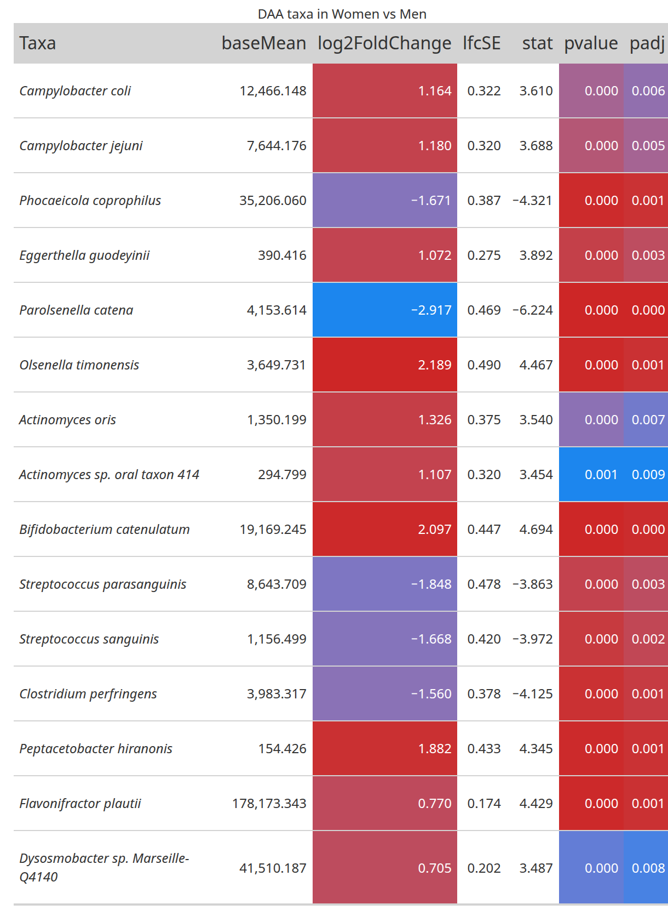
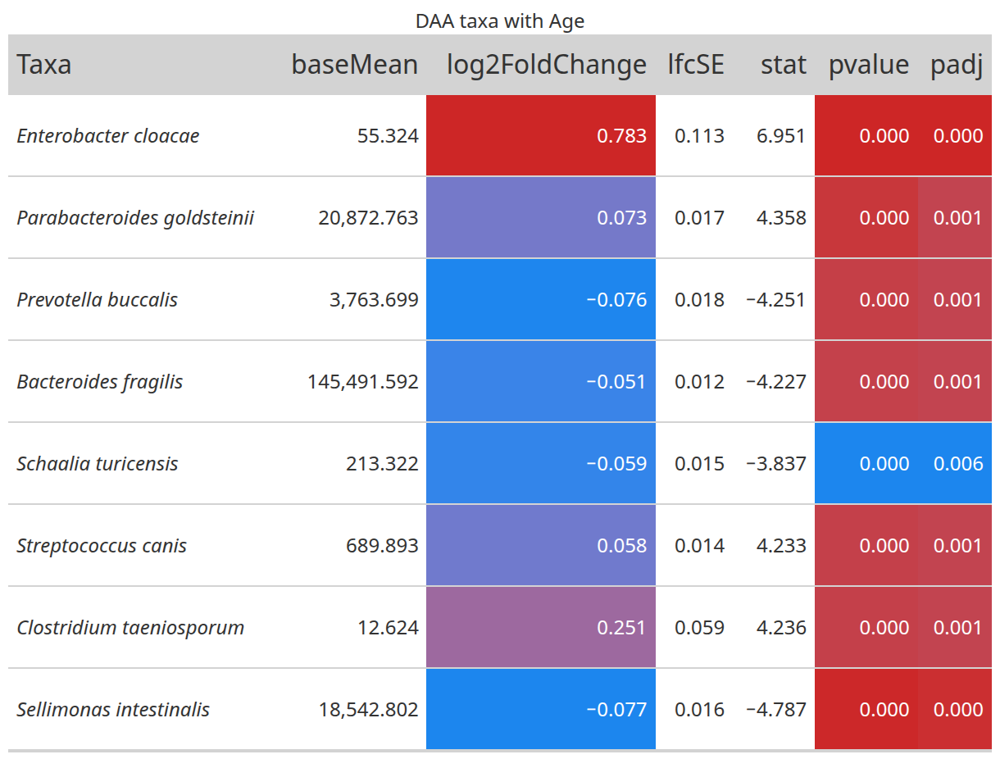

<!-- README.md is generated from README.Rmd. Please edit that file -->

# G4Micro

<!-- badges: start -->

[](https://github.com/CarlosMoraMartinez/G4Micro/actions/workflows/R-CMD-check.yaml)
<!-- badges: end -->

G4Micro contains helper functions used to analyze microbiome data in the
Mora-Martinez, Molina-Mendoza et al. paper.

## Installation

First, it is necessary to install the following packages and linux
dependencies:

- libgdal-dev, libgeos-dev, libproj-dev, libudunits2-dev
- DMwR2
- UBL
- catboost

``` bash
sudo apt-get update
sudo apt-get install -y libgdal-dev libgeos-dev libproj-dev libudunits2-dev
```

``` r
# install.packages("remotes")
# install.packages("devtools")

remotes::install_url("https://cran.r-project.org/src/contrib/Archive/DMwR2/DMwR2_0.0.2.tar.gz")
devtools::install_github("paobranco/UBL",ref="master")
remotes::install_github("catboost/catboost", subdir = "catboost/R-package")
```

You can install the development version of G4Micro from
[GitHub](https://github.com/) with:

``` r
# install.packages("pak")
pak::pak("CarlosMoraMartinez/G4Micro")

# Alternatively
devtools::install_github("Displayr/flipPlots")
```

## Alpha Diversity Analysis

Load a phyloseq object with filtered and rarefied counts:

``` r
library(G4Micro)

data("phobj_raref")
phobj_raref
#> phyloseq-class experiment-level object
#> otu_table()   OTU Table:         [ 820 taxa and 105 samples ]
#> sample_data() Sample Data:       [ 105 samples by 119 sample variables ]
#> tax_table()   Taxonomy Table:    [ 820 taxa by 8 taxonomic ranks ]
```

A list with default options is also loaded. Copy it and modify it to use
a custom output directory.

``` r
opt <- opt_default
opt$out <- "~/test_g4micro/"
if(!dir.exists(opt$out)) dir.create(opt$out)

restoreopt <- restauraropt_mk(opt)
```

The `restoreopt` function will allow to reset the options to the state
when `restauraropt_mk` was called. To do that, execute:

``` r
opt <- restoreopt(opt)
```

Calculate alpha diversity indices:

``` r
outdir <- paste0(opt$out, "/AlphaDiversity/")
if(!dir.exists(outdir)) dir.create(outdir)

alpha_indices <-  c("Observed", "Chao1", "Shannon", "InvSimpson")

divtab <- calculateAlphaDiversityTable(phseq_obj = phobj_raref, outdir = outdir, 
                                       indices = alpha_indices, name = "AlphaDiv" )

divtab %>% select(sampleID, Condition, all_of(alpha_indices)) %>% 
  head %>% kableExtra::kable()
```

| sampleID | Condition | Observed |  Chao1 |  Shannon | InvSimpson |
|:---------|:----------|---------:|-------:|---------:|-----------:|
| 1        | Control   |      398 | 398.50 | 2.657452 |   4.633405 |
| 10       | Control   |      385 | 385.00 | 2.648691 |   6.380959 |
| 100      | Control   |      329 | 329.00 | 2.982834 |   8.265564 |
| 102      | Control   |      467 | 470.75 | 2.400962 |   3.655553 |
| 103      | Control   |      447 | 447.00 | 3.509609 |  14.020145 |
| 104      | Control   |      425 | 426.00 | 3.350646 |  11.243856 |

Test statistical differences between alpha diversity indices:

``` r

alphadif <- testDiversityDifferences(divtab, alpha_indices, 
                                     groupvars = c("Condition", "Sex"), 
                                     outdir = outdir, name = "AlphaDiv_test")

alphadif %>% kableExtra::kable()
```

| variable | groups | comparison | anova_F | anova_p | t_test | wilcox_test | shapiro_normality_test | bartlett_test | levene_test | t_corrected | wilcox_corrected |
|:---|:---|:---|---:|---:|---:|---:|---:|---:|---:|---:|---:|
| Observed | Condition | all | 17.7978164 | 0.0000530 | 0.0000534 | 0.0000116 | 0.0619656 | 0.8568824 | 0.5272713 | 0.0002357 | 0.0000521 |
| Observed | Sex | all | 0.2479607 | 0.6195762 | 0.6314333 | 0.6967562 | 0.0619656 | 0.1402254 | 0.2483335 | 0.6314333 | 0.7039865 |
| Chao1 | Condition | all | 17.5858912 | 0.0000583 | 0.0000589 | 0.0000130 | 0.0555764 | 0.8639881 | 0.5548703 | 0.0002357 | 0.0000521 |
| Chao1 | Sex | all | 0.2715406 | 0.6034188 | 0.6160029 | 0.7039865 | 0.0555764 | 0.1298843 | 0.2503562 | 0.6314333 | 0.7039865 |
| Shannon | Condition | all | 6.5589718 | 0.0118849 | 0.0081650 | 0.0094101 | 0.0316829 | 0.0450513 | 0.0448880 | 0.0163301 | 0.0188202 |
| Shannon | Sex | all | 4.6825487 | 0.0327818 | 0.0413045 | 0.0479763 | 0.0316829 | 0.0625120 | 0.0753922 | 0.0660873 | 0.0639684 |
| InvSimpson | Condition | all | 7.3268397 | 0.0079536 | 0.0063039 | 0.0002664 | 0.0000007 | 0.2403767 | 0.8755440 | 0.0163301 | 0.0007105 |
| InvSimpson | Sex | all | 2.6117387 | 0.1091344 | 0.1110623 | 0.0334241 | 0.0000007 | 0.8501868 | 0.9598410 | 0.1480830 | 0.0534785 |

Fit linear models using a main variable and several covariates:

``` r
interestvar <- "Condition"
extravars <- c("BMI", "Age", "Sex")

models <- makeLinearModelsSingleVariable(divtab, interestvar,
                                            extravars,
                                            alpha_indices,
                                            combos=1,
                                            outdir = outdir, 
                                            name = "linmodels1")
```

Now show tests for single variables:

``` r
models$single_anovas %>% select(-mod1, -mod2, nvars, Index, 
                                model, reduced_model, Df, 
                                `Pr(>F)`, padj_all) %>% 
  kableExtra::kable()
#> Warning: 'xfun::attr()' is deprecated.
#> Use 'xfun::attr2()' instead.
#> See help("Deprecated")
#> Warning: 'xfun::attr()' is deprecated.
#> Use 'xfun::attr2()' instead.
#> See help("Deprecated")
```

| nvars | Index | model | reduced_model | Df | Sum Sq | Mean Sq | F value | Pr(\>F) | padj_all | padj_bymodel |
|---:|:---|:---|:---|---:|---:|---:|---:|---:|---:|---:|
| 0 | Observed | Observed ~ Condition | Observed ~ 1 | 1 | 3.523265e+04 | 3.523265e+04 | 17.7978164 | 0.0000530 | 0.0004660 | 0.0001165 |
| 0 | Observed | Observed ~ BMI | Observed ~ 1 | 1 | 1.093986e+01 | 1.093986e+01 | 0.0046904 | 0.9455340 | 0.9455340 | 0.9455340 |
| 0 | Observed | Observed ~ Age | Observed ~ 1 | 1 | 3.446667e+03 | 3.446667e+03 | 1.5062743 | 0.2225062 | 0.3310526 | 0.2225062 |
| 0 | Observed | Observed ~ Sex | Observed ~ 1 | 1 | 5.743002e+02 | 5.743002e+02 | 0.2479607 | 0.6195762 | 0.7080871 | 0.6195762 |
| 0 | Chao1 | Chao1 ~ Condition | Chao1 ~ 1 | 1 | 3.511109e+04 | 3.511109e+04 | 17.5858912 | 0.0000583 | 0.0004660 | 0.0001165 |
| 0 | Chao1 | Chao1 ~ BMI | Chao1 ~ 1 | 1 | 1.156455e+01 | 1.156455e+01 | 0.0049232 | 0.9442004 | 0.9455340 | 0.9455340 |
| 0 | Chao1 | Chao1 ~ Age | Chao1 ~ 1 | 1 | 3.554813e+03 | 3.554813e+03 | 1.5436111 | 0.2169023 | 0.3310526 | 0.2225062 |
| 0 | Chao1 | Chao1 ~ Sex | Chao1 ~ 1 | 1 | 6.330390e+02 | 6.330390e+02 | 0.2715406 | 0.6034188 | 0.7080871 | 0.6195762 |
| 0 | Shannon | Shannon ~ Condition | Shannon ~ 1 | 1 | 8.804086e-01 | 8.804086e-01 | 6.5589718 | 0.0118849 | 0.0475394 | 0.0118849 |
| 0 | Shannon | Shannon ~ BMI | Shannon ~ 1 | 1 | 2.073893e-01 | 2.073893e-01 | 1.4736690 | 0.2275987 | 0.3310526 | 0.6375174 |
| 0 | Shannon | Shannon ~ Age | Shannon ~ 1 | 1 | 4.814537e-01 | 4.814537e-01 | 3.4861927 | 0.0647264 | 0.1479461 | 0.1294529 |
| 0 | Shannon | Shannon ~ Sex | Shannon ~ 1 | 1 | 6.394895e-01 | 6.394895e-01 | 4.6825487 | 0.0327818 | 0.1049018 | 0.1311273 |
| 0 | InvSimpson | InvSimpson ~ Condition | InvSimpson ~ 1 | 1 | 1.951732e+02 | 1.951732e+02 | 7.3268397 | 0.0079536 | 0.0424190 | 0.0106048 |
| 0 | InvSimpson | InvSimpson ~ BMI | InvSimpson ~ 1 | 1 | 2.833181e+01 | 2.833181e+01 | 1.0039184 | 0.3187587 | 0.4250116 | 0.6375174 |
| 0 | InvSimpson | InvSimpson ~ Age | InvSimpson ~ 1 | 1 | 9.930915e+01 | 9.930915e+01 | 3.6022252 | 0.0605020 | 0.1479461 | 0.1294529 |
| 0 | InvSimpson | InvSimpson ~ Sex | InvSimpson ~ 1 | 1 | 7.267788e+01 | 7.267788e+01 | 2.6117387 | 0.1091344 | 0.2182687 | 0.2182687 |

Show tests using covariates:

``` r
models$anovas %>% select(-mod1, -mod2, nvars, Index, 
                                model, reduced_model, Df, 
                                `Pr(>F)`, padj_all) %>% 
  kableExtra::kable()
#> Warning: 'xfun::attr()' is deprecated.
#> Use 'xfun::attr2()' instead.
#> See help("Deprecated")
#> Warning: 'xfun::attr()' is deprecated.
#> Use 'xfun::attr2()' instead.
#> See help("Deprecated")
```

| nvars | Index | model | reduced_model | Res.Df | RSS | Df | Sum of Sq | F | Pr(\>F) | padj_all | padj_bymodel |
|---:|:---|:---|:---|---:|---:|---:|---:|---:|---:|---:|---:|
| 1 | Observed | Observed ~ BMI + Condition | Observed ~ BMI | 101 | 235573.99217 | -1 | -3.585624e+04 | 17.953457 | 0.0000505 | 0.0002016 | 0.0001106 |
| 1 | Observed | Observed ~ Age + Condition | Observed ~ Age | 103 | 235685.29487 | -1 | -3.179639e+04 | 15.906859 | 0.0001253 | 0.0002803 | 0.0002803 |
| 1 | Observed | Observed ~ Sex + Condition | Observed ~ Sex | 103 | 238557.66170 | -1 | -3.492959e+04 | 17.496696 | 0.0000610 | 0.0002016 | 0.0001344 |
| 1 | Chao1 | Chao1 ~ BMI + Condition | Chao1 ~ BMI | 101 | 237245.79132 | -1 | -3.575986e+04 | 17.748070 | 0.0000553 | 0.0002016 | 0.0001106 |
| 1 | Chao1 | Chao1 ~ Age + Condition | Chao1 ~ Age | 103 | 237200.78334 | -1 | -3.157463e+04 | 15.662465 | 0.0001402 | 0.0002803 | 0.0002803 |
| 1 | Chao1 | Chao1 ~ Sex + Condition | Chao1 ~ Sex | 103 | 240122.55767 | -1 | -3.479060e+04 | 17.282460 | 0.0000672 | 0.0002016 | 0.0001344 |
| 1 | Shannon | Shannon ~ BMI + Condition | Shannon ~ BMI | 101 | 14.21372 | -1 | -8.394543e-01 | 6.276637 | 0.0138488 | 0.0166185 | 0.0138488 |
| 1 | Shannon | Shannon ~ Age + Condition | Shannon ~ Age | 103 | 14.22461 | -1 | -5.884919e-01 | 4.401999 | 0.0383674 | 0.0383674 | 0.0383674 |
| 1 | Shannon | Shannon ~ Sex + Condition | Shannon ~ Sex | 103 | 14.06657 | -1 | -8.227205e-01 | 6.336335 | 0.0133857 | 0.0166185 | 0.0133857 |
| 1 | InvSimpson | InvSimpson ~ BMI + Condition | InvSimpson ~ BMI | 101 | 2850.34382 | -1 | -1.943362e+02 | 7.316854 | 0.0080310 | 0.0135770 | 0.0107080 |
| 1 | InvSimpson | InvSimpson ~ Age + Condition | InvSimpson ~ Age | 103 | 2839.59009 | -1 | -1.330645e+02 | 5.014763 | 0.0273031 | 0.0297852 | 0.0364041 |
| 1 | InvSimpson | InvSimpson ~ Sex + Condition | InvSimpson ~ Sex | 103 | 2866.22137 | -1 | -1.860592e+02 | 7.080927 | 0.0090513 | 0.0135770 | 0.0120684 |

Finally, plot differences (recalculating statistical tests):

``` r
cat_vars <- c("Condition", "Sex")
num_vars <- c("BMI", "bristol_scale")

divplots <- getAlphaDiversity(phobj_raref, 
                              vars = cat_vars, 
                              qvars = num_vars,
                              opt,
                              indices = alpha_indices,
                              correct_pvalues = T, correct_pvalues_indices = T,
                              name = "alphaplots1", w = 10, h = 4)

cowplot::plot_grid(plotlist = divplots, nrow = 4)
```


## Beta Diversity Analysis

PCoA on Bray-Curtis distances:

``` r
vars <- c("Condition", "Sex", "BMI")
betaplots <- makeAllPCoAs(phobj_raref, outdir,
                          method = "PCoA",
                          name = "PCoA_Bray",
                          dist_type = "bray",
                          dist_name = "Bray-Curtis",
                          vars2plot = vars,
                          extradims = 2:3,
                          labelsamples = "sampleID",
                          create_pdfs = T)

cowplot::plot_grid(plotlist = betaplots, nrow = 3)
```


NMDS on Bray-Curtis distances:

``` r
vars <- c("Condition", "Sex")
betaplots <- makeAllPCoAs(phobj_raref, outdir,
                          method = "NMDS",
                          name = "NMDS_Bray",
                          dist_type = "bray",
                          dist_name = "Bray-Curtis",
                          vars2plot = vars,
                          extradims = 2,
                          labelsamples = "sampleID",
                          create_pdfs = T)
#> Square root transformation
#> Wisconsin double standardization
#> Run 0 stress 0.2424031 
#> Run 1 stress 0.2450175 
#> Run 2 stress 0.2413875 
#> ... New best solution
#> ... Procrustes: rmse 0.03453249  max resid 0.2040516 
#> Run 3 stress 0.2479525 
#> Run 4 stress 0.241074 
#> ... New best solution
#> ... Procrustes: rmse 0.01783737  max resid 0.1590581 
#> Run 5 stress 0.2443354 
#> Run 6 stress 0.2418592 
#> Run 7 stress 0.2698389 
#> Run 8 stress 0.2411031 
#> ... Procrustes: rmse 0.003079735  max resid 0.02145552 
#> Run 9 stress 0.2413875 
#> ... Procrustes: rmse 0.01783647  max resid 0.158801 
#> Run 10 stress 0.2418271 
#> Run 11 stress 0.2423542 
#> Run 12 stress 0.2453918 
#> Run 13 stress 0.2451823 
#> Run 14 stress 0.2418291 
#> Run 15 stress 0.2425758 
#> Run 16 stress 0.2426894 
#> Run 17 stress 0.2454342 
#> Run 18 stress 0.2423002 
#> Run 19 stress 0.2429148 
#> Run 20 stress 0.2418242 
#> *** Best solution was not repeated -- monoMDS stopping criteria:
#>      3: no. of iterations >= maxit
#>     17: stress ratio > sratmax

cowplot::plot_grid(plotlist = betaplots, nrow = 1)
```



Perform PERMANOVA with the `vegan::adonis2` function:

``` r
exclude_vars <- names(sample_data(phobj_raref))
exclude_vars <- exclude_vars[!exclude_vars %in% c("Condition", "Sex", "smoking_status")]
result <- makePermanova(phobj_raref,
              dist_method = "bray", 
              seed = 123, 
              exclude_vars = exclude_vars, 
              outname = "permatest") 

result %>% kableExtra::kable()
```

| variable | DF_var | DF_Residual | DF_Total | SumOfSQs_var | SumOfSQs_Residual | SumOfSQs_Total | R2_var | R2_Residual | R2_Total | F_statistic | P | perm_disp_P | perm_disp_F | perm_disp_npermuts | capscaleanova_P | capscaleanopva_F | padj | perm_disp_Padj | capscaleanova_Padj |
|:---|---:|---:|---:|---:|---:|---:|---:|---:|---:|---:|---:|---:|---:|---:|---:|---:|---:|---:|---:|
| Condition | 1 | 103 | 104 | 0.8948514 | 16.24310 | 17.13795 | 0.0522146 | 0.9477854 | 1 | 5.6743915 | 0.0009990 | 0.0009990 | 16.924618 | 1000 | 0.0009990 | 5.2391028 | 0.0029970 | 0.0029970 | 0.0029970 |
| Sex | 1 | 103 | 104 | 0.3830715 | 16.75488 | 17.13795 | 0.0223522 | 0.9776478 | 1 | 2.3549177 | 0.0059940 | 0.0719281 | 3.406087 | 1000 | 0.0049950 | 2.2296666 | 0.0089910 | 0.1078921 | 0.0074925 |
| smoking_status | 1 | 92 | 93 | 0.1354557 | 14.70321 | 14.83867 | 0.0091286 | 0.9908714 | 1 | 0.8475647 | 0.6143856 | 0.1788212 | 2.038981 | 1000 | 0.5684316 | 0.8872324 | 0.6143856 | 0.1788212 | 0.5684316 |

Perform PERMANOVA with the `vegan::adonis2` function, using covariates:

``` r
permaformulas <- c(
  "braydist ~ Condition + Sex",
  "braydist ~ Condition + BMI",
  "braydist ~ Condition + Age",
  "braydist ~ Condition + Sex + BMI",
  "braydist ~ Condition + BMI + Sex + Age"
)

result <- makePermanovaFormulas(phobj_raref,
                  permaformulas,
                  dist_method = "bray", 
                  seed = 123, 
                  outname = "adonis2formulas")

result$res %>% select(model, variable, DF_var, DF_Residual, DF_Total, R2_var, R2_Residual, R2_Total, F_statistic, P, padj) %>% kableExtra::kable()
```

| model | variable | DF_var | DF_Residual | DF_Total | R2_var | R2_Residual | R2_Total | F_statistic | P | padj |
|:---|:---|---:|---:|---:|---:|---:|---:|---:|---:|---:|
| braydist ~ Condition + Sex | Condition | 1 | 1 | 1 | 0.0522146 | 0.0522146 | 0.0522146 | 5.744691 | 0.001 | 0.0026000 |
| braydist ~ Condition + Sex | Sex | 1 | 1 | 1 | 0.0206875 | 0.0206875 | 0.0206875 | 2.276055 | 0.006 | 0.0130000 |
| braydist ~ Condition + Sex | Residual | 102 | 102 | 102 | 0.9270979 | 0.9270979 | 0.9270979 | NA | NA | NA |
| braydist ~ Condition + Sex | Total | 104 | 104 | 104 | 1.0000000 | 1.0000000 | 1.0000000 | NA | NA | NA |
| braydist ~ Condition + BMI | Condition | 1 | 1 | 1 | 0.0538639 | 0.0538639 | 0.0538639 | 5.787504 | 0.001 | 0.0026000 |
| braydist ~ Condition + BMI | BMI | 1 | 1 | 1 | 0.0154440 | 0.0154440 | 0.0154440 | 1.659407 | 0.054 | 0.0638182 |
| braydist ~ Condition + BMI | Residual | 100 | 100 | 100 | 0.9306922 | 0.9306922 | 0.9306922 | NA | NA | NA |
| braydist ~ Condition + BMI | Total | 102 | 102 | 102 | 1.0000000 | 1.0000000 | 1.0000000 | NA | NA | NA |
| braydist ~ Condition + Age | Condition | 1 | 1 | 1 | 0.0522146 | 0.0522146 | 0.0522146 | 5.694023 | 0.001 | 0.0026000 |
| braydist ~ Condition + Age | Age | 1 | 1 | 1 | 0.0124377 | 0.0124377 | 0.0124377 | 1.356340 | 0.146 | 0.1581667 |
| braydist ~ Condition + Age | Residual | 102 | 102 | 102 | 0.9353476 | 0.9353476 | 0.9353476 | NA | NA | NA |
| braydist ~ Condition + Age | Total | 104 | 104 | 104 | 1.0000000 | 1.0000000 | 1.0000000 | NA | NA | NA |
| braydist ~ Condition + Sex + BMI | Condition | 1 | 1 | 1 | 0.0538639 | 0.0538639 | 0.0538639 | 5.855260 | 0.001 | 0.0026000 |
| braydist ~ Condition + Sex + BMI | Sex | 1 | 1 | 1 | 0.0196885 | 0.0196885 | 0.0196885 | 2.140238 | 0.013 | 0.0211250 |
| braydist ~ Condition + Sex + BMI | BMI | 1 | 1 | 1 | 0.0157244 | 0.0157244 | 0.0157244 | 1.709314 | 0.049 | 0.0638182 |
| braydist ~ Condition + Sex + BMI | Residual | 99 | 99 | 99 | 0.9107233 | 0.9107233 | 0.9107233 | NA | NA | NA |
| braydist ~ Condition + Sex + BMI | Total | 102 | 102 | 102 | 1.0000000 | 1.0000000 | 1.0000000 | NA | NA | NA |
| braydist ~ Condition + BMI + Sex + Age | Condition | 1 | 1 | 1 | 0.0538639 | 0.0538639 | 0.0538639 | 5.866420 | 0.001 | 0.0026000 |
| braydist ~ Condition + BMI + Sex + Age | BMI | 1 | 1 | 1 | 0.0154440 | 0.0154440 | 0.0154440 | 1.682034 | 0.052 | 0.0638182 |
| braydist ~ Condition + BMI + Sex + Age | Sex | 1 | 1 | 1 | 0.0199689 | 0.0199689 | 0.0199689 | 2.174855 | 0.013 | 0.0211250 |
| braydist ~ Condition + BMI + Sex + Age | Age | 1 | 1 | 1 | 0.0109142 | 0.0109142 | 0.0109142 | 1.188693 | 0.274 | 0.2740000 |
| braydist ~ Condition + BMI + Sex + Age | Residual | 98 | 98 | 98 | 0.8998090 | 0.8998090 | 0.8998090 | NA | NA | NA |
| braydist ~ Condition + BMI + Sex + Age | Total | 102 | 102 | 102 | 1.0000000 | 1.0000000 | 1.0000000 | NA | NA | NA |

Model objects can also be accessed:

``` r
result$modelos[[4]]
#> Permutation test for adonis under reduced model
#> Terms added sequentially (first to last)
#> Permutation: free
#> Number of permutations: 999
#> 
#> adonis2(formula = as.formula(form), data = sampledf, by = adonisby, na.action = na.exclude)
#>            Df SumOfSqs      R2      F Pr(>F)    
#> Condition   1   0.9096 0.05386 5.8553  0.001 ***
#> Sex         1   0.3325 0.01969 2.1402  0.013 *  
#> BMI         1   0.2655 0.01572 1.7093  0.049 *  
#> Residual   99  15.3790 0.91072                  
#> Total     102  16.8866 1.00000                  
#> ---
#> Signif. codes:  0 '***' 0.001 '**' 0.01 '*' 0.05 '.' 0.1 ' ' 1
```

## Differential Abundance Analysis with DESeq2

First, use Sex and Age as covariates. We will use the `phyloseq` object
with the raw counts, since `DESeq2` normalizes data internally.

Several tables and plots will be saved to the `opt$out` directory.

``` r
data("phobj_filtonly")
test_vars <- c("Condition", "Sex", "Age")

result <- deseq_full_pipeline(phobj_filtonly, name = "CondSexAge", vars2deseq = test_vars, opt = opt)
#> Minfreq:  0.05 , setting minsampleswithcount to  5.25
#> All contrasts TRUE, intersecting Taxon list
#> Error plotDispEsts
```

Several tables and plots will be saved automatically to the `opt$out`
directory.

See results table for the contrast of Condition:

``` r

taxa2plot <- result$all_contrasts$Condition_Depression_vs_Control$resdf %>% filter(!is.na(padj ) & padj < 0.01) %>% 
     arrange(padj) %>% pull(taxon) 
gtt <- result$all_contrasts$Condition_Depression_vs_Control$res %>% getGTTableFromRes(taxa2plot, "DAA taxa in Depressed vs Controls")
```


See results table for the contrast of Sex:

``` r

taxa2plot <- result$all_contrasts$Sex_Female_vs_Male$resdf %>% filter(!is.na(padj ) & padj < 0.01) %>% 
     arrange(padj) %>% pull(taxon) 
gtt <- result$all_contrasts$Sex_Female_vs_Male$res %>% getGTTableFromRes(taxa2plot, "DAA taxa in Women vs Men")
```



See results table for the contrast of Age:

``` r

taxa2plot <- result$all_contrasts$Age$resdf %>% filter(!is.na(padj ) & padj < 0.01) %>% 
     arrange(padj) %>% pull(taxon) 
gtt <- result$all_contrasts$Age$res %>% getGTTableFromRes(taxa2plot, "DAA taxa with Age")
```



Make heatmap:

``` r

taxa2plot <- result$all_contrasts$Condition_Depression_vs_Control$resdf %>% filter(!is.na(padj ) & padj < 0.01) %>% 
     arrange(padj) %>% pull(taxon) 

makeHeatmap(result$all_contrasts$Condition_Depression_vs_Control$resdf, 
            result$dds, 
            result$vst_counts_df, 
            c("Condition", "Sex", "Age"),
            opt, 
            name ="test_heatmap",
            logscale = F, 
            ptype="padj", 
            trim_values = TRUE, 
            taxalist=taxa2plot, 
            max_hm_h=10, max_hm_w=12)
```


Also, different contrasts can be compared:

``` r

mainContrast <- result$all_contrasts$Condition_Depression_vs_Control
contrastlist2 <- list(
  result$all_contrasts$Sex_Female_vs_Male$resdf,
  result$all_contrasts$Age$resdf
) %>% lapply(\(x)return(list(resdf=x)))

names(contrastlist2) <- c( "Sex", "Age")

contrast_names_pretty <- c("Depression vs Control",  "Female vs Male", "Age")

compareLFCContrats2(contrastlist2, mainContrast, 
                   contrast_names_pretty, "Depression_vs_Control", 
                   plim_select= 0.001, plim_plot=0.05,
                   name2remove = "xxx",
                   resdfname="resdf", 
                   outdir = opt$out, 
                   name="LFC_Comparison_AgeAndBMI_allCombos_p05", 
                   w=12, h=12, scale_mode = "free")
```


``` r

restoreopt <- restauraropt_mk(opt)
```

## DESeq2 analysis with interaction

Instead of using several covariates in an additive way, one may specify
more complex formulas with interactions:

``` r

phobj_filtered <- subset_samples(
  phobj_filtonly,
  !is.na(Condition) &
  !is.na(Sex) &
  !is.na(BMI) &
  !is.na(Age)
)
result_int <- getDeseqResults(phobj_filtered, opt = opt, name = "CBSA_interaction", 
                          variables=NULL, formula="~ Condition + BMI + Sex * Age")


taxa2plot <- result_int$all_contrasts$Condition_Depression_vs_Control$resdf %>% 
  filter(!is.na(padj ) & padj < 0.01) %>% 
  arrange(padj) %>% pull(taxon) 

gtt <- result_int$all_contrasts$Condition_Depression_vs_Control$res %>% 
  getGTTableFromRes(taxa2plot, "DAA between Depr and C controlling for  BMI + Sex * Age")
```


