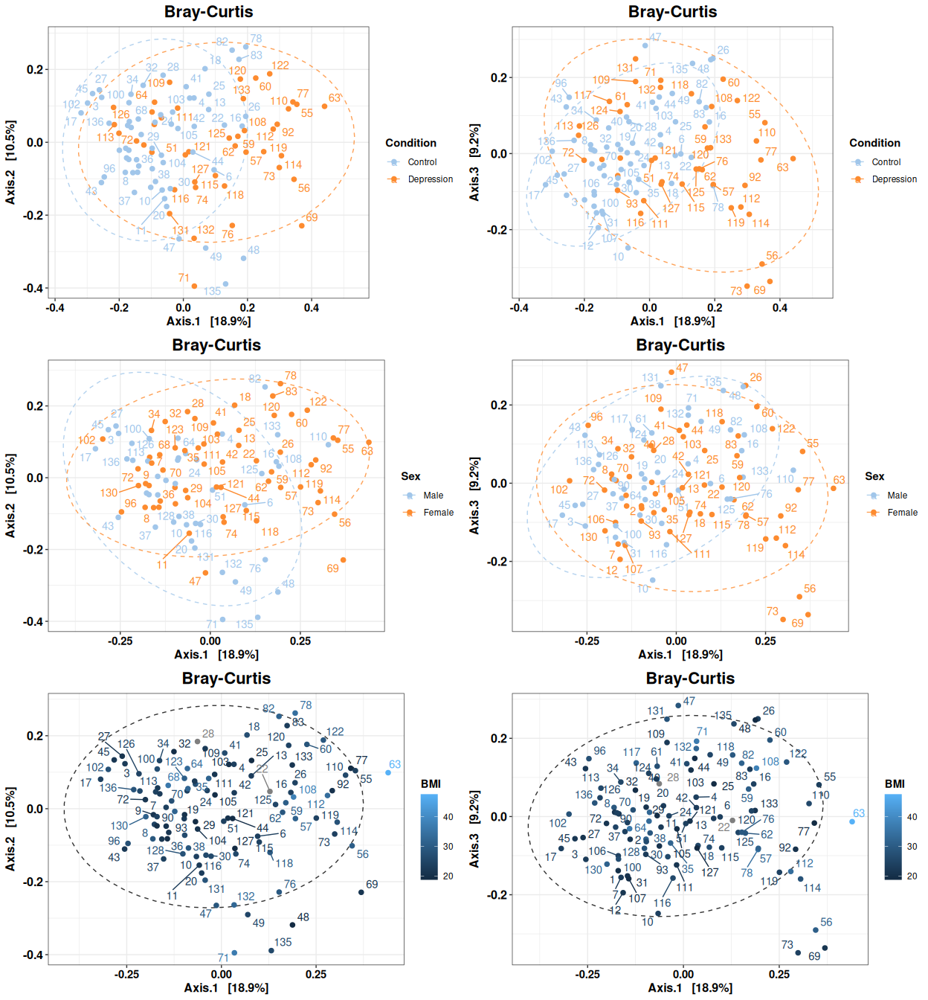

<!-- README.md is generated from README.Rmd. Please edit that file -->

# G4Micro

<!-- badges: start -->

[](https://github.com/CarlosMoraMartinez/G4Micro/actions/workflows/R-CMD-check.yaml)
<!-- badges: end -->

G4Micro contains helper functions used to analyze microbiome data in the
Mora-Martinez, Molina-Mendoza et al. paper.

## Installation

First, it is necessary to install the following packages and linux
dependencies:

- libgdal-dev, libgeos-dev, libproj-dev, libudunits2-dev
- DMwR2
- UBL
- catboost

``` bash
sudo apt-get update
sudo apt-get install -y libgdal-dev libgeos-dev libproj-dev libudunits2-dev
```

``` r
# install.packages("remotes")
# install.packages("devtools")

remotes::install_url("https://cran.r-project.org/src/contrib/Archive/DMwR2/DMwR2_0.0.2.tar.gz")
devtools::install_github("paobranco/UBL",ref="master")
remotes::install_github("catboost/catboost", subdir = "catboost/R-package")
```

You can install the development version of G4Micro from
[GitHub](https://github.com/) with:

``` r
# install.packages("pak")
pak::pak("CarlosMoraMartinez/G4Micro")

# Alternatively
devtools::install_github("Displayr/flipPlots")
```

## Alpha Diversity Analysis

Load a phyloseq object with filtered and rarefied counts:

``` r
library(G4Micro)
library(cowplot)

data("phobj_raref")
phobj_raref
#> phyloseq-class experiment-level object
#> otu_table()   OTU Table:         [ 820 taxa and 105 samples ]
#> sample_data() Sample Data:       [ 105 samples by 119 sample variables ]
#> tax_table()   Taxonomy Table:    [ 820 taxa by 8 taxonomic ranks ]
```

A list with default options is also loaded. Copy it and modify it to use
a custom output directory.

``` r
opt <- opt_default
opt$out <- "~/test_g4micro/"
if(!dir.exists(opt$out)) dir.create(opt$out)

restoreopt <- restauraropt_mk(opt)
```

The `restoreopt` function will allow to reset the options to the state
when `restauraropt_mk` was called. To do that, execute:

``` r
opt <- restoreopt(opt)
```

Calculate alpha diversity indices:

``` r
outdir <- paste0(opt$out, "/AlphaDiversity/")
if(!dir.exists(outdir)) dir.create(outdir)

alpha_indices <-  c("Observed", "Chao1", "Shannon", "InvSimpson")

divtab <- calculateAlphaDiversityTable(phseq_obj = phobj_raref, outdir = outdir, 
                                       indices = alpha_indices, name = "AlphaDiv" )

divtab %>% select(sampleID, Condition, all_of(alpha_indices)) %>% 
  head %>% kableExtra::kable()
```

| sampleID | Condition | Observed |  Chao1 |  Shannon | InvSimpson |
|:---------|:----------|---------:|-------:|---------:|-----------:|
| 1        | Control   |      398 | 398.50 | 2.657452 |   4.633405 |
| 10       | Control   |      385 | 385.00 | 2.648691 |   6.380959 |
| 100      | Control   |      329 | 329.00 | 2.982834 |   8.265564 |
| 102      | Control   |      467 | 470.75 | 2.400962 |   3.655553 |
| 103      | Control   |      447 | 447.00 | 3.509609 |  14.020145 |
| 104      | Control   |      425 | 426.00 | 3.350646 |  11.243856 |

Test statistical differences between alpha diversity indices:

``` r

alphadif <- testDiversityDifferences(divtab, alpha_indices, 
                                     groupvars = c("Condition", "Sex"), 
                                     outdir = outdir, name = "AlphaDiv_test")

alphadif %>% kableExtra::kable()
```

| variable | groups | comparison | anova_F | anova_p | t_test | wilcox_test | shapiro_normality_test | bartlett_test | levene_test | t_corrected | wilcox_corrected |
|:---|:---|:---|---:|---:|---:|---:|---:|---:|---:|---:|---:|
| Observed | Condition | all | 17.7978164 | 0.0000530 | 0.0000534 | 0.0000116 | 0.0619656 | 0.8568824 | 0.5272713 | 0.0002357 | 0.0000521 |
| Observed | Sex | all | 0.2479607 | 0.6195762 | 0.6314333 | 0.6967562 | 0.0619656 | 0.1402254 | 0.2483335 | 0.6314333 | 0.7039865 |
| Chao1 | Condition | all | 17.5858912 | 0.0000583 | 0.0000589 | 0.0000130 | 0.0555764 | 0.8639881 | 0.5548703 | 0.0002357 | 0.0000521 |
| Chao1 | Sex | all | 0.2715406 | 0.6034188 | 0.6160029 | 0.7039865 | 0.0555764 | 0.1298843 | 0.2503562 | 0.6314333 | 0.7039865 |
| Shannon | Condition | all | 6.5589718 | 0.0118849 | 0.0081650 | 0.0094101 | 0.0316829 | 0.0450513 | 0.0448880 | 0.0163301 | 0.0188202 |
| Shannon | Sex | all | 4.6825487 | 0.0327818 | 0.0413045 | 0.0479763 | 0.0316829 | 0.0625120 | 0.0753922 | 0.0660873 | 0.0639684 |
| InvSimpson | Condition | all | 7.3268397 | 0.0079536 | 0.0063039 | 0.0002664 | 0.0000007 | 0.2403767 | 0.8755440 | 0.0163301 | 0.0007105 |
| InvSimpson | Sex | all | 2.6117387 | 0.1091344 | 0.1110623 | 0.0334241 | 0.0000007 | 0.8501868 | 0.9598410 | 0.1480830 | 0.0534785 |

Fit linear models using a main variable and several covariates:

``` r
interestvar <- "Condition"
extravars <- c("BMI", "Age", "Sex")

models <- makeLinearModelsSingleVariable(divtab, interestvar,
                                            extravars,
                                            alpha_indices,
                                            combos=1,
                                            outdir = outdir, 
                                            name = "linmodels1")
```

Now show tests for single variables:

``` r
models$single_anovas %>% select(-mod1, -mod2, nvars, Index, 
                                model, reduced_model, Df, 
                                `Pr(>F)`, padj_all) %>% 
  kableExtra::kable()
#> Warning: 'xfun::attr()' is deprecated.
#> Use 'xfun::attr2()' instead.
#> See help("Deprecated")
#> Warning: 'xfun::attr()' is deprecated.
#> Use 'xfun::attr2()' instead.
#> See help("Deprecated")
```

| nvars | Index | model | reduced_model | Df | Sum Sq | Mean Sq | F value | Pr(\>F) | padj_all | padj_bymodel |
|---:|:---|:---|:---|---:|---:|---:|---:|---:|---:|---:|
| 0 | Observed | Observed ~ Condition | Observed ~ 1 | 1 | 3.523265e+04 | 3.523265e+04 | 17.7978164 | 0.0000530 | 0.0004660 | 0.0001165 |
| 0 | Observed | Observed ~ BMI | Observed ~ 1 | 1 | 1.093986e+01 | 1.093986e+01 | 0.0046904 | 0.9455340 | 0.9455340 | 0.9455340 |
| 0 | Observed | Observed ~ Age | Observed ~ 1 | 1 | 3.446667e+03 | 3.446667e+03 | 1.5062743 | 0.2225062 | 0.3310526 | 0.2225062 |
| 0 | Observed | Observed ~ Sex | Observed ~ 1 | 1 | 5.743002e+02 | 5.743002e+02 | 0.2479607 | 0.6195762 | 0.7080871 | 0.6195762 |
| 0 | Chao1 | Chao1 ~ Condition | Chao1 ~ 1 | 1 | 3.511109e+04 | 3.511109e+04 | 17.5858912 | 0.0000583 | 0.0004660 | 0.0001165 |
| 0 | Chao1 | Chao1 ~ BMI | Chao1 ~ 1 | 1 | 1.156455e+01 | 1.156455e+01 | 0.0049232 | 0.9442004 | 0.9455340 | 0.9455340 |
| 0 | Chao1 | Chao1 ~ Age | Chao1 ~ 1 | 1 | 3.554813e+03 | 3.554813e+03 | 1.5436111 | 0.2169023 | 0.3310526 | 0.2225062 |
| 0 | Chao1 | Chao1 ~ Sex | Chao1 ~ 1 | 1 | 6.330390e+02 | 6.330390e+02 | 0.2715406 | 0.6034188 | 0.7080871 | 0.6195762 |
| 0 | Shannon | Shannon ~ Condition | Shannon ~ 1 | 1 | 8.804086e-01 | 8.804086e-01 | 6.5589718 | 0.0118849 | 0.0475394 | 0.0118849 |
| 0 | Shannon | Shannon ~ BMI | Shannon ~ 1 | 1 | 2.073893e-01 | 2.073893e-01 | 1.4736690 | 0.2275987 | 0.3310526 | 0.6375174 |
| 0 | Shannon | Shannon ~ Age | Shannon ~ 1 | 1 | 4.814537e-01 | 4.814537e-01 | 3.4861927 | 0.0647264 | 0.1479461 | 0.1294529 |
| 0 | Shannon | Shannon ~ Sex | Shannon ~ 1 | 1 | 6.394895e-01 | 6.394895e-01 | 4.6825487 | 0.0327818 | 0.1049018 | 0.1311273 |
| 0 | InvSimpson | InvSimpson ~ Condition | InvSimpson ~ 1 | 1 | 1.951732e+02 | 1.951732e+02 | 7.3268397 | 0.0079536 | 0.0424190 | 0.0106048 |
| 0 | InvSimpson | InvSimpson ~ BMI | InvSimpson ~ 1 | 1 | 2.833181e+01 | 2.833181e+01 | 1.0039184 | 0.3187587 | 0.4250116 | 0.6375174 |
| 0 | InvSimpson | InvSimpson ~ Age | InvSimpson ~ 1 | 1 | 9.930915e+01 | 9.930915e+01 | 3.6022252 | 0.0605020 | 0.1479461 | 0.1294529 |
| 0 | InvSimpson | InvSimpson ~ Sex | InvSimpson ~ 1 | 1 | 7.267788e+01 | 7.267788e+01 | 2.6117387 | 0.1091344 | 0.2182687 | 0.2182687 |

Show tests using covariates:

``` r
models$anovas %>% select(-mod1, -mod2, nvars, Index, 
                                model, reduced_model, Df, 
                                `Pr(>F)`, padj_all) %>% 
  kableExtra::kable()
#> Warning: 'xfun::attr()' is deprecated.
#> Use 'xfun::attr2()' instead.
#> See help("Deprecated")
#> Warning: 'xfun::attr()' is deprecated.
#> Use 'xfun::attr2()' instead.
#> See help("Deprecated")
```

| nvars | Index | model | reduced_model | Res.Df | RSS | Df | Sum of Sq | F | Pr(\>F) | padj_all | padj_bymodel |
|---:|:---|:---|:---|---:|---:|---:|---:|---:|---:|---:|---:|
| 1 | Observed | Observed ~ BMI + Condition | Observed ~ BMI | 101 | 235573.99217 | -1 | -3.585624e+04 | 17.953457 | 0.0000505 | 0.0002016 | 0.0001106 |
| 1 | Observed | Observed ~ Age + Condition | Observed ~ Age | 103 | 235685.29487 | -1 | -3.179639e+04 | 15.906859 | 0.0001253 | 0.0002803 | 0.0002803 |
| 1 | Observed | Observed ~ Sex + Condition | Observed ~ Sex | 103 | 238557.66170 | -1 | -3.492959e+04 | 17.496696 | 0.0000610 | 0.0002016 | 0.0001344 |
| 1 | Chao1 | Chao1 ~ BMI + Condition | Chao1 ~ BMI | 101 | 237245.79132 | -1 | -3.575986e+04 | 17.748070 | 0.0000553 | 0.0002016 | 0.0001106 |
| 1 | Chao1 | Chao1 ~ Age + Condition | Chao1 ~ Age | 103 | 237200.78334 | -1 | -3.157463e+04 | 15.662465 | 0.0001402 | 0.0002803 | 0.0002803 |
| 1 | Chao1 | Chao1 ~ Sex + Condition | Chao1 ~ Sex | 103 | 240122.55767 | -1 | -3.479060e+04 | 17.282460 | 0.0000672 | 0.0002016 | 0.0001344 |
| 1 | Shannon | Shannon ~ BMI + Condition | Shannon ~ BMI | 101 | 14.21372 | -1 | -8.394543e-01 | 6.276637 | 0.0138488 | 0.0166185 | 0.0138488 |
| 1 | Shannon | Shannon ~ Age + Condition | Shannon ~ Age | 103 | 14.22461 | -1 | -5.884919e-01 | 4.401999 | 0.0383674 | 0.0383674 | 0.0383674 |
| 1 | Shannon | Shannon ~ Sex + Condition | Shannon ~ Sex | 103 | 14.06657 | -1 | -8.227205e-01 | 6.336335 | 0.0133857 | 0.0166185 | 0.0133857 |
| 1 | InvSimpson | InvSimpson ~ BMI + Condition | InvSimpson ~ BMI | 101 | 2850.34382 | -1 | -1.943362e+02 | 7.316854 | 0.0080310 | 0.0135770 | 0.0107080 |
| 1 | InvSimpson | InvSimpson ~ Age + Condition | InvSimpson ~ Age | 103 | 2839.59009 | -1 | -1.330645e+02 | 5.014763 | 0.0273031 | 0.0297852 | 0.0364041 |
| 1 | InvSimpson | InvSimpson ~ Sex + Condition | InvSimpson ~ Sex | 103 | 2866.22137 | -1 | -1.860592e+02 | 7.080927 | 0.0090513 | 0.0135770 | 0.0120684 |

Finally, plot differences (recalculating statistical tests):

``` r
cat_vars <- c("Condition", "Sex")
num_vars <- c("BMI", "bristol_scale")

divplots <- getAlphaDiversity(phobj_raref, 
                              vars = cat_vars, 
                              qvars = num_vars,
                              opt,
                              indices = alpha_indices,
                              correct_pvalues = T, correct_pvalues_indices = T,
                              name = "alphaplots1", w = 10, h = 4)

cowplot::plot_grid(plotlist = divplots, nrow = 4)
```


## Beta Diversity Analysis

PCoA on Bray-Curtis distances:

``` r
vars <- c("Condition", "Sex", "BMI")
betaplots <- makeAllPCoAs(phobj_raref, outdir,
                          method = "PCoA",
                          name = "PCoA_Bray",
                          dist_type = "bray",
                          dist_name = "Bray-Curtis",
                          vars2plot = vars,
                          extradims = 2:3,
                          labelsamples = "sampleID",
                          create_pdfs = T)

cowplot::plot_grid(plotlist = betaplots, nrow = 3)
```



NMDS on Bray-Curtis distances:

``` r
vars <- c("Condition", "Sex")
betaplots <- makeAllPCoAs(phobj_raref, outdir,
                          method = "NMDS",
                          name = "NMDS_Bray",
                          dist_type = "bray",
                          dist_name = "Bray-Curtis",
                          vars2plot = vars,
                          extradims = 2,
                          labelsamples = "sampleID",
                          create_pdfs = T)
#> Square root transformation
#> Wisconsin double standardization
#> Run 0 stress 0.2424031 
#> Run 1 stress 0.2447432 
#> Run 2 stress 0.2417309 
#> ... New best solution
#> ... Procrustes: rmse 0.03070245  max resid 0.2058067 
#> Run 3 stress 0.2422827 
#> Run 4 stress 0.2424651 
#> Run 5 stress 0.2412914 
#> ... New best solution
#> ... Procrustes: rmse 0.01082094  max resid 0.07100492 
#> Run 6 stress 0.2473113 
#> Run 7 stress 0.2411035 
#> ... New best solution
#> ... Procrustes: rmse 0.01081649  max resid 0.0780362 
#> Run 8 stress 0.2451824 
#> Run 9 stress 0.2448274 
#> Run 10 stress 0.2418611 
#> Run 11 stress 0.250654 
#> Run 12 stress 0.2428996 
#> Run 13 stress 0.2470644 
#> Run 14 stress 0.244742 
#> Run 15 stress 0.2451799 
#> Run 16 stress 0.2451732 
#> Run 17 stress 0.2747277 
#> Run 18 stress 0.2414438 
#> ... Procrustes: rmse 0.007116678  max resid 0.06182965 
#> Run 19 stress 0.2464021 
#> Run 20 stress 0.2425719 
#> *** Best solution was not repeated -- monoMDS stopping criteria:
#>      2: no. of iterations >= maxit
#>     18: stress ratio > sratmax

cowplot::plot_grid(plotlist = betaplots, nrow = 1)
```


Perform PERMANOVA with the `vegan::adonis2` function:

``` r
exclude_vars <- names(sample_data(phobj_raref))
exclude_vars <- exclude_vars[!exclude_vars %in% c("Condition", "Sex", "smoking_status")]
result <- makePermanova(phobj_raref,
              dist_method = "bray", 
              seed = 123, 
              exclude_vars = exclude_vars, 
              outname = "permatest") 

result %>% kableExtra::kable()
```

| variable | DF_var | DF_Residual | DF_Total | SumOfSQs_var | SumOfSQs_Residual | SumOfSQs_Total | R2_var | R2_Residual | R2_Total | F_statistic | P | perm_disp_P | perm_disp_F | perm_disp_npermuts | capscaleanova_P | capscaleanopva_F | padj | perm_disp_Padj | capscaleanova_Padj |
|:---|---:|---:|---:|---:|---:|---:|---:|---:|---:|---:|---:|---:|---:|---:|---:|---:|---:|---:|---:|
| Condition | 1 | 103 | 104 | 0.8948514 | 16.24310 | 17.13795 | 0.0522146 | 0.9477854 | 1 | 5.6743915 | 0.0009990 | 0.0009990 | 16.924618 | 1000 | 0.0009990 | 5.2391028 | 0.0029970 | 0.0029970 | 0.0029970 |
| Sex | 1 | 103 | 104 | 0.3830715 | 16.75488 | 17.13795 | 0.0223522 | 0.9776478 | 1 | 2.3549177 | 0.0059940 | 0.0719281 | 3.406087 | 1000 | 0.0049950 | 2.2296666 | 0.0089910 | 0.1078921 | 0.0074925 |
| smoking_status | 1 | 92 | 93 | 0.1354557 | 14.70321 | 14.83867 | 0.0091286 | 0.9908714 | 1 | 0.8475647 | 0.6143856 | 0.1788212 | 2.038981 | 1000 | 0.5684316 | 0.8872324 | 0.6143856 | 0.1788212 | 0.5684316 |

Perform PERMANOVA with the `vegan::adonis2` function, using covariates:

``` r
permaformulas <- c(
  "braydist ~ Condition + Sex",
  "braydist ~ Condition + BMI",
  "braydist ~ Condition + Age",
  "braydist ~ Condition + Sex + BMI",
  "braydist ~ Condition + BMI + Sex + Age"
)

result <- makePermanovaFormulas(phobj_raref,
                  permaformulas,
                  dist_method = "bray", 
                  seed = 123, 
                  outname = "adonis2formulas")

result$res %>% select(model, variable, DF_var, DF_Residual, DF_Total, R2_var, R2_Residual, R2_Total, F_statistic, P, padj) %>% kableExtra::kable()
```

| model | variable | DF_var | DF_Residual | DF_Total | R2_var | R2_Residual | R2_Total | F_statistic | P | padj |
|:---|:---|---:|---:|---:|---:|---:|---:|---:|---:|---:|
| braydist ~ Condition + Sex | Condition | 1 | 1 | 1 | 0.0522146 | 0.0522146 | 0.0522146 | 5.744691 | 0.001 | 0.0026000 |
| braydist ~ Condition + Sex | Sex | 1 | 1 | 1 | 0.0206875 | 0.0206875 | 0.0206875 | 2.276055 | 0.006 | 0.0130000 |
| braydist ~ Condition + Sex | Residual | 102 | 102 | 102 | 0.9270979 | 0.9270979 | 0.9270979 | NA | NA | NA |
| braydist ~ Condition + Sex | Total | 104 | 104 | 104 | 1.0000000 | 1.0000000 | 1.0000000 | NA | NA | NA |
| braydist ~ Condition + BMI | Condition | 1 | 1 | 1 | 0.0538639 | 0.0538639 | 0.0538639 | 5.787504 | 0.001 | 0.0026000 |
| braydist ~ Condition + BMI | BMI | 1 | 1 | 1 | 0.0154440 | 0.0154440 | 0.0154440 | 1.659407 | 0.054 | 0.0638182 |
| braydist ~ Condition + BMI | Residual | 100 | 100 | 100 | 0.9306922 | 0.9306922 | 0.9306922 | NA | NA | NA |
| braydist ~ Condition + BMI | Total | 102 | 102 | 102 | 1.0000000 | 1.0000000 | 1.0000000 | NA | NA | NA |
| braydist ~ Condition + Age | Condition | 1 | 1 | 1 | 0.0522146 | 0.0522146 | 0.0522146 | 5.694023 | 0.001 | 0.0026000 |
| braydist ~ Condition + Age | Age | 1 | 1 | 1 | 0.0124377 | 0.0124377 | 0.0124377 | 1.356340 | 0.146 | 0.1581667 |
| braydist ~ Condition + Age | Residual | 102 | 102 | 102 | 0.9353476 | 0.9353476 | 0.9353476 | NA | NA | NA |
| braydist ~ Condition + Age | Total | 104 | 104 | 104 | 1.0000000 | 1.0000000 | 1.0000000 | NA | NA | NA |
| braydist ~ Condition + Sex + BMI | Condition | 1 | 1 | 1 | 0.0538639 | 0.0538639 | 0.0538639 | 5.855260 | 0.001 | 0.0026000 |
| braydist ~ Condition + Sex + BMI | Sex | 1 | 1 | 1 | 0.0196885 | 0.0196885 | 0.0196885 | 2.140238 | 0.013 | 0.0211250 |
| braydist ~ Condition + Sex + BMI | BMI | 1 | 1 | 1 | 0.0157244 | 0.0157244 | 0.0157244 | 1.709314 | 0.049 | 0.0638182 |
| braydist ~ Condition + Sex + BMI | Residual | 99 | 99 | 99 | 0.9107233 | 0.9107233 | 0.9107233 | NA | NA | NA |
| braydist ~ Condition + Sex + BMI | Total | 102 | 102 | 102 | 1.0000000 | 1.0000000 | 1.0000000 | NA | NA | NA |
| braydist ~ Condition + BMI + Sex + Age | Condition | 1 | 1 | 1 | 0.0538639 | 0.0538639 | 0.0538639 | 5.866420 | 0.001 | 0.0026000 |
| braydist ~ Condition + BMI + Sex + Age | BMI | 1 | 1 | 1 | 0.0154440 | 0.0154440 | 0.0154440 | 1.682034 | 0.052 | 0.0638182 |
| braydist ~ Condition + BMI + Sex + Age | Sex | 1 | 1 | 1 | 0.0199689 | 0.0199689 | 0.0199689 | 2.174855 | 0.013 | 0.0211250 |
| braydist ~ Condition + BMI + Sex + Age | Age | 1 | 1 | 1 | 0.0109142 | 0.0109142 | 0.0109142 | 1.188693 | 0.274 | 0.2740000 |
| braydist ~ Condition + BMI + Sex + Age | Residual | 98 | 98 | 98 | 0.8998090 | 0.8998090 | 0.8998090 | NA | NA | NA |
| braydist ~ Condition + BMI + Sex + Age | Total | 102 | 102 | 102 | 1.0000000 | 1.0000000 | 1.0000000 | NA | NA | NA |

Model objects can also be accessed:

``` r
result$modelos[[4]]
#> Permutation test for adonis under reduced model
#> Terms added sequentially (first to last)
#> Permutation: free
#> Number of permutations: 999
#> 
#> adonis2(formula = as.formula(form), data = sampledf, by = adonisby, na.action = na.exclude)
#>            Df SumOfSqs      R2      F Pr(>F)    
#> Condition   1   0.9096 0.05386 5.8553  0.001 ***
#> Sex         1   0.3325 0.01969 2.1402  0.013 *  
#> BMI         1   0.2655 0.01572 1.7093  0.049 *  
#> Residual   99  15.3790 0.91072                  
#> Total     102  16.8866 1.00000                  
#> ---
#> Signif. codes:  0 '***' 0.001 '**' 0.01 '*' 0.05 '.' 0.1 ' ' 1
```

## Differential Abundance Analysis with DESeq2

First, use Sex and Age as covariates. We will use the `phyloseq` object
with the raw counts, since `DESeq2` normalizes data internally.

Several tables and plots will be saved to the `opt$out` directory.

``` r
data("phobj_filtonly")
test_vars <- c("Condition", "Sex", "Age")

result <- deseq_full_pipeline(phobj_filtonly, name = "CondSexAge", vars2deseq = test_vars, opt = opt)
#> Minfreq:  0.05 , setting minsampleswithcount to  5.25
#> All contrasts TRUE, intersecting Taxon list
#> Error plotDispEsts
```

Several tables and plots will be saved automatically to the `opt$out`
directory.

See results table for the contrast of Condition:

``` r

taxa2plot <- result$all_contrasts$Condition_Depression_vs_Control$resdf %>% filter(!is.na(padj ) & padj < 0.01) %>% 
     arrange(padj) %>% pull(taxon) 
gtt <- result$all_contrasts$Condition_Depression_vs_Control$res %>% getGTTableFromRes(taxa2plot, "DAA taxa in Depressed vs Controls")
```


See results table for the contrast of Sex:

``` r

taxa2plot <- result$all_contrasts$Sex_Female_vs_Male$resdf %>% filter(!is.na(padj ) & padj < 0.01) %>% 
     arrange(padj) %>% pull(taxon) 
gtt <- result$all_contrasts$Sex_Female_vs_Male$res %>% getGTTableFromRes(taxa2plot, "DAA taxa in Women vs Men")
```


See results table for the contrast of Age:

``` r

taxa2plot <- result$all_contrasts$Age$resdf %>% filter(!is.na(padj ) & padj < 0.01) %>% 
     arrange(padj) %>% pull(taxon) 
gtt <- result$all_contrasts$Age$res %>% getGTTableFromRes(taxa2plot, "DAA taxa with Age")
```


Make heatmap:

``` r

taxa2plot <- result$all_contrasts$Condition_Depression_vs_Control$resdf %>% filter(!is.na(padj ) & padj < 0.01) %>% 
     arrange(padj) %>% pull(taxon) 

makeHeatmap(result$all_contrasts$Condition_Depression_vs_Control$resdf, 
            result$dds, 
            result$vst_counts_df, 
            c("Condition", "Sex", "Age"),
            opt, 
            name ="test_heatmap",
            logscale = F, 
            ptype="padj", 
            trim_values = TRUE, 
            taxalist=taxa2plot, 
            max_hm_h=10, max_hm_w=12)
```


Also, different contrasts can be compared:

``` r

mainContrast <- result$all_contrasts$Condition_Depression_vs_Control
contrastlist2 <- list(
  result$all_contrasts$Sex_Female_vs_Male$resdf,
  result$all_contrasts$Age$resdf
) %>% lapply(\(x)return(list(resdf=x)))

names(contrastlist2) <- c( "Sex_Female_vs_Male", "Age")

contrast_names_ordered <- c("Depression vs Control",  gsub("_", " ", names(contrastlist2)))

compareLFCContrats2(contrastlist2, mainContrast, 
                   contrast_names_ordered, "Depression_vs_Control", 
                   plim_select= 0.001, plim_plot=0.05,
                   name2remove = "xxx",
                   resdfname="resdf", 
                   outdir = opt$out, 
                   name="LFC_Comparison_AgeAndBMI_allCombos_p05", 
                   w=12, h=12, scale_mode = "free")
```


``` r

restoreopt <- restauraropt_mk(opt)
```

## DESeq2 analysis with interaction

Instead of using several covariates in an additive way, one may specify
more complex formulas with interactions:

``` r

phobj_filtered <- subset_samples(
  phobj_filtonly,
  !is.na(Condition) &
  !is.na(Sex) &
  !is.na(BMI) &
  !is.na(Age)
)
result_int <- getDeseqResults(phobj_filtered, opt = opt, name = "CBSA_interaction", 
                          variables=NULL, formula="~ Condition + BMI + Sex * Age")


taxa2plot <- result_int$all_contrasts$Condition_Depression_vs_Control$resdf %>% 
  filter(!is.na(padj ) & padj < 0.01) %>% 
  arrange(padj) %>% pull(taxon) 

gtt <- result_int$all_contrasts$Condition_Depression_vs_Control$res %>% 
  getGTTableFromRes(taxa2plot, "DAA between Depr and C controlling for  BMI + Sex * Age")
```


## Train classification models based on microbiome

Let’s train a set of machine learning models to classify samples into
classes.

First, select taxa from DESeq2 results:

``` r

resultds <- getDeseqResults(phobj_filtonly, opt = opt, variables=c("Condition"))

taxa_2train <- resultds$resdf %>% 
  dplyr::filter(padj <= 0.05) %>%
    pull(taxon)

cat("Selecting ", length(taxa_2train), " taxa for PCA.")
#> Selecting  111  taxa for PCA.
```

Now, compute a PCA using VST abundances from DESeq2 (or transformed in
any other way):

``` r

pca_results <- makeAllPCAs(phobj_filtonly, 
                           resultds$vst_counts_df, 
                           taxa_2train, 
                           c("Condition"), 
                           opt, 
                           name = "PCA_DiffTaxaPadj")
pca_results$Condition$plots
```


Train models with the PCs. The package provides default parameters for
XGBoost, CatBoost and RandomForest stored in the
`xgboost_params_default`, `catboost_params_default` and
`randomforest_params_default` variables.

``` r
metadata <- data.frame(sample_data(phobj_filtonly))

predmodels <-callDoAllModelsFromALLPCAs(pca_results, 
                                        name="TrainWithPCA1",
                                        metadata=metadata,
                                        vars2pca=c("Condition"), 
                                        nfolds = 0, # Leave one out
                                        xgboost_params = xgboost_params_default, 
                                        catboost_params = catboost_params_default,
                                        randomforest_params = randomforest_params_default,
                                        do_smote = FALSE, opt = opt)
#> -- GLM finished
#> -- SVMs finished
#> -- RandomForest finished
#> -- C5.0 Tree finished
#> -- NaiveBayes finished
#> -- KNN finished
#> -- K-Means finished
#> -- XGBoost finished
#> -- CatBoost finished
#> 1 : L1= 0 , L2= 1  
#> 2 : L1= 1 , L2= 2  
#> 3 : L1= 2 , L2= 3  
#> 4 : L1= 3 , L2= 4  
#> 5 : L1= 4 , L2= 5  
#> 6 : L1= 5 , L2= 6  
#> 7 : L1= 6 , L2= 7  
#> 8 : L1= 7 , L2= 8  
#> 9 : L1= 8 , L2= 9  
#> 10 : L1= 9 , L2= 10  
#> 11 : L1= 10 , L2= 11  
#> 12 : L1= 11 , L2= 12  
#> 13 : L1= 12 , L2= 13  
#> 14 : L1= 13 , L2= 14  
#> 15 : L1= 14 , L2= 15  
#> 16 : L1= 15 , L2= 16  
#> 17 : L1= 16 , L2= 17  
#> 18 : L1= 17 , L2= 18  
#> 19 : L1= 18 , L2= 19  
#> 20 : L1= 19 , L2= 20  
#> 21 : L1= 20 , L2= 21  
#> 22 : L1= 21 , L2= 22  
#> 23 : L1= 22 , L2= 23  
#> 24 : L1= 23 , L2= 24  
#> 25 : L1= 24 , L2= 25  
#> 26 : L1= 25 , L2= 26  
#> 27 : L1= 26 , L2= 27  
#> 28 : L1= 27 , L2= 28  
#> 29 : L1= 28 , L2= 29  
#> 30 : L1= 29 , L2= 30  
#> 31 : L1= 30 , L2= 31  
#> 32 : L1= 31 , L2= 32  
#> 33 : L1= 32 , L2= 33  
#> 34 : L1= 33 , L2= 34  
#> 35 : L1= 34 , L2= 35  
#> 36 : L1= 35 , L2= 36  
#> 37 : L1= 36 , L2= 37  
#> 38 : L1= 37 , L2= 38  
#> 39 : L1= 38 , L2= 39  
#> 40 : L1= 39 , L2= 40  
#> 41 : L1= 40 , L2= 41  
#> 42 : L1= 41 , L2= 42  
#> 43 : L1= 42 , L2= 43  
#> 44 : L1= 43 , L2= 44  
#> 45 : L1= 44 , L2= 45  
#> 46 : L1= 45 , L2= 46  
#> 47 : L1= 46 , L2= 47  
#> 48 : L1= 47 , L2= 48  
#> 49 : L1= 48 , L2= 49  
#> 50 : L1= 49 , L2= 50  
#> 51 : L1= 50 , L2= 51  
#> 52 : L1= 51 , L2= 52  
#> 53 : L1= 52 , L2= 53  
#> 54 : L1= 53 , L2= 54  
#> 55 : L1= 54 , L2= 55  
#> 56 : L1= 55 , L2= 56  
#> 57 : L1= 56 , L2= 57  
#> 58 : L1= 57 , L2= 58  
#> 59 : L1= 58 , L2= 59  
#> 60 : L1= 59 , L2= 60  
#> 61 : L1= 60 , L2= 61  
#> 62 : L1= 61 , L2= 62  
#> 63 : L1= 62 , L2= 63  
#> 64 : L1= 63 , L2= 64  
#> 65 : L1= 64 , L2= 65  
#> 66 : L1= 65 , L2= 66  
#> 67 : L1= 66 , L2= 67  
#> 68 : L1= 67 , L2= 68  
#> 69 : L1= 68 , L2= 69  
#> 70 : L1= 69 , L2= 70  
#> 71 : L1= 70 , L2= 71  
#> 72 : L1= 71 , L2= 72  
#> 73 : L1= 72 , L2= 73  
#> 74 : L1= 73 , L2= 74  
#> 75 : L1= 74 , L2= 75  
#> 76 : L1= 75 , L2= 76  
#> 77 : L1= 76 , L2= 77  
#> 78 : L1= 77 , L2= 78  
#> 79 : L1= 78 , L2= 79  
#> 80 : L1= 79 , L2= 80  
#> 81 : L1= 80 , L2= 81  
#> 82 : L1= 81 , L2= 82  
#> 83 : L1= 82 , L2= 83  
#> 84 : L1= 83 , L2= 84  
#> 85 : L1= 84 , L2= 85  
#> 86 : L1= 85 , L2= 86  
#> 87 : L1= 86 , L2= 87  
#> 88 : L1= 87 , L2= 88  
#> 89 : L1= 88 , L2= 89  
#> 90 : L1= 89 , L2= 90  
#> 91 : L1= 90 , L2= 91  
#> 92 : L1= 91 , L2= 92  
#> 93 : L1= 92 , L2= 93  
#> 94 : L1= 93 , L2= 94  
#> 95 : L1= 94 , L2= 95  
#> 96 : L1= 95 , L2= 96  
#> 97 : L1= 96 , L2= 97  
#> 98 : L1= 97 , L2= 98  
#> 99 : L1= 98 , L2= 99  
#> 100 : L1= 99 , L2= 100  
#> 101 : L1= 100 , L2= 101  
#> 102 : L1= 101 , L2= 102  
#> 103 : L1= 102 , L2= 103  
#> 104 : L1= 103 , L2= 104  
#> 105 : L1= 104 , L2= 105
#> -- Ensemble finished

predmodels$modummary %>% select(model, BalancedAccuracy_l1out, AUC_l1out, 
                                  Accuracy_l1out, Kappa_l1out, 
                                  Sensitivity_l1out, Specificity_l1out, PPV_l1out, NPV_l1out, Precision_l1out, Recall_l1out) %>% 
  mutate_if(is.numeric, round, 3) %>% 
  rename_with(~ str_remove(.x, "_l1out")) %>%
  kableExtra::kable()
```

| model | BalancedAccuracy | AUC | Accuracy | Kappa | Sensitivity | Specificity | PPV | NPV | Precision | Recall |
|:---|---:|---:|---:|---:|---:|---:|---:|---:|---:|---:|
| KNN-K=5 | 0.886 | 0.889 | 0.895 | 0.781 | 0.837 | 0.935 | 0.900 | 0.892 | 0.900 | 0.837 |
| KNN-K=7 | 0.886 | 0.895 | 0.895 | 0.781 | 0.837 | 0.935 | 0.900 | 0.892 | 0.900 | 0.837 |
| Ensemble | 0.878 | 0.907 | 0.886 | 0.762 | 0.837 | 0.919 | 0.878 | 0.891 | 0.878 | 0.837 |
| SVM-linear | 0.844 | 0.923 | 0.867 | 0.714 | 0.721 | 0.968 | 0.939 | 0.833 | 0.939 | 0.721 |
| KNN-K=9 | 0.862 | 0.904 | 0.867 | 0.724 | 0.837 | 0.887 | 0.837 | 0.887 | 0.837 | 0.837 |
| KNN-K=11 | 0.859 | 0.917 | 0.867 | 0.722 | 0.814 | 0.903 | 0.854 | 0.875 | 0.854 | 0.814 |
| RandomForest | 0.854 | 0.884 | 0.857 | 0.706 | 0.837 | 0.871 | 0.818 | 0.885 | 0.818 | 0.837 |
| C5.0 Tree | 0.854 | 0.908 | 0.857 | 0.706 | 0.837 | 0.871 | 0.818 | 0.885 | 0.818 | 0.837 |
| XGBoost | 0.847 | 0.901 | 0.857 | 0.701 | 0.791 | 0.903 | 0.850 | 0.862 | 0.850 | 0.791 |
| KMeans | 0.833 | 0.856 | 0.857 | 0.693 | 0.698 | 0.968 | 0.938 | 0.822 | 0.938 | 0.698 |
| KNN-K=3 | 0.839 | 0.860 | 0.848 | 0.683 | 0.791 | 0.887 | 0.829 | 0.859 | 0.829 | 0.791 |
| SVM-radial | 0.820 | 0.889 | 0.838 | 0.657 | 0.721 | 0.919 | 0.861 | 0.826 | 0.861 | 0.721 |
| CatBoost | 0.838 | 0.918 | 0.838 | 0.669 | 0.837 | 0.839 | 0.783 | 0.881 | 0.783 | 0.837 |
| NaiveBayes | 0.809 | 0.923 | 0.829 | 0.635 | 0.698 | 0.919 | 0.857 | 0.814 | 0.857 | 0.698 |
| logistic_regression | 0.811 | 0.922 | 0.819 | 0.625 | 0.767 | 0.855 | 0.786 | 0.841 | 0.786 | 0.767 |

Plot the performance metrics:

``` r
# First we need to create a nested list
results_list <- list("phobj_filtonly"=list("PCA"=predmodels))

plots <- makeLinePlotComparingSamePhobjModels(phname = "phobj_filtonly", 
                                     all_model_results = results_list,
                                     get_pcnames_from = "PCA",
                                     opt = opt,
                                     plot_extra = FALSE, 
                                     order_by_measure = "BalancedAccuracy_l1out",
                                     name="test_models", 
                                     sel_method_name="PCA")
 
cw <- cowplot::plot_grid(plotlist=list(plots$g5 + theme(legend.position = "none"),
                                       plots$g6 + theme(legend.position = "none"),
                                       plots$g3 + theme(legend.position = "none"),
                                       plots$g4 + theme(legend.position = "none"),
                                       plots$g7 + theme(legend.position = "none")), ncol = 2)

print(cw)
```


